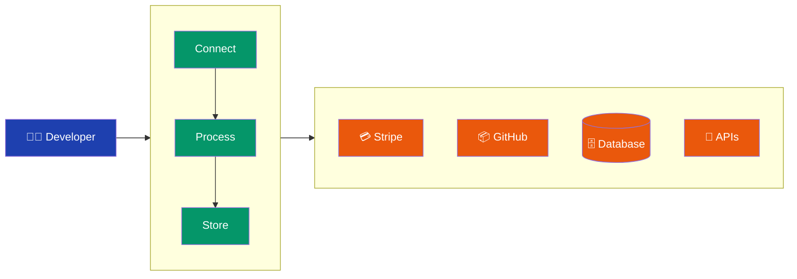

# Open PaaS Platform Architecture

Open PaaS Platform follows a simple philosophy: **Connect anything to everything, with code that scales**. Whether you're syncing customer data from Stripe, processing webhooks from GitHub, or building custom workflows, the platform handles the complexity while you focus on business logic.

## The Big Picture

Think of it as a **smart data pipeline**: data flows in from external services, gets processed according to your rules, and flows out to where it needs to go.

## How It Actually Works

The platform operates in three main phases that mirror how you think about integration problems:

### Connect Phase
Data enters the platform through connectors that establish secure connections to external services. The Connector Engine manages authentication, handles rate limiting, and converts data formats automatically. Each connector is isolated and can be updated independently without affecting other integrations.

### Process Phase  
Once data is ingested, the Workflow Engine orchestrates processing according to your business logic. The platform supports real-time processing for immediate actions, batch processing for large datasets, and event handling for webhook responses. Custom transformations and validations ensure data quality throughout the pipeline.

### Store Phase
Processed data flows to appropriate storage systems based on access patterns and requirements. Fast-access data goes to Redis cache, persistent data to PostgreSQL, while large objects use file storage. The platform maintains data lineage and audit trails throughout the entire flow.

## Architecture Deep Dive

The platform's architecture is built around three core engines that work together to handle the complete integration lifecycle:

### Connector Engine
At the foundation sits the Connector Engine, which abstracts away the complexity of external system integration. It dynamically loads connectors for different services, manages connection pooling, and implements automatic retry logic with exponential backoff. Health monitoring ensures connections remain stable, while each connector runs in isolation to prevent failures from cascading across the system.

### Workflow Orchestrator  
The Workflow Orchestrator sits above the connector layer, managing complex multi-step processes that span multiple systems. It supports conditional logic, parallel execution paths, and comprehensive error handling. Workflows can include human approval steps, external API calls, and data transformations, all while maintaining state and providing rollback capabilities.

### Processing Infrastructure
The processing layer adapts to different workload patterns through specialized processors:

The **Real-time Processor** handles streaming data with sub-second latency requirements. It's optimized for webhook processing, live data synchronization, and instant notifications where immediate response is critical.

The **Batch Processor** tackles large-volume operations efficiently. It manages scheduled jobs, bulk data imports, and resource-intensive transformations while providing progress tracking and the ability to resume interrupted operations.

The **Event Handler** processes asynchronous events from webhooks, message queues, and internal triggers. It ensures reliable event delivery through persistent queuing and supports event replay for debugging complex integration flows.

### Data Architecture
Data flows through a multi-tier storage architecture designed for different access patterns:

**Redis Cache** provides high-performance in-memory storage for frequently accessed data, session information, and temporary processing results. This reduces latency for real-time operations and serves as a buffer for high-throughput scenarios.

**PostgreSQL Database** serves as the primary relational store for structured data including user accounts, integration configurations, workflow definitions, and comprehensive audit logs. It's optimized for ACID compliance and supports complex queries across related data.

**Message Queue** infrastructure using Redis or RabbitMQ handles asynchronous communication between components. It manages event distribution, task queuing, and inter-service communication while ensuring reliable message delivery and supporting priority-based processing.

## Security & Compliance

**Multi-layered Security Model**: Defense in depth with authentication, authorization, encryption, and network security. All API communications use TLS 1.3, and sensitive data is encrypted at rest using AES-256.

**Identity & Access Management**: OAuth 2.0 and JWT-based authentication with fine-grained role-based access control. API keys provide programmatic access with configurable permissions and rate limits.

**Audit & Compliance**: Comprehensive logging of all system activities with immutable audit trails. Supports compliance frameworks like SOC 2, GDPR, and HIPAA through configurable data handling policies.

**Network Security**: VPC isolation, firewall rules, and DDoS protection. All internal communications are encrypted, and external access is controlled through security groups and access policies.

## Scalability & Performance

**Horizontal Scaling**: All core services are designed to scale horizontally. Auto-scaling policies monitor CPU, memory, and queue depth to automatically adjust capacity based on demand.

**Performance Optimization**: Multi-layer caching strategy with Redis for hot data and CDN for static assets. Database query optimization and connection pooling ensure consistent performance under load.

**Resource Management**: Intelligent resource allocation with priority queuing for critical operations. Background tasks are throttled to prevent resource contention with real-time operations.
