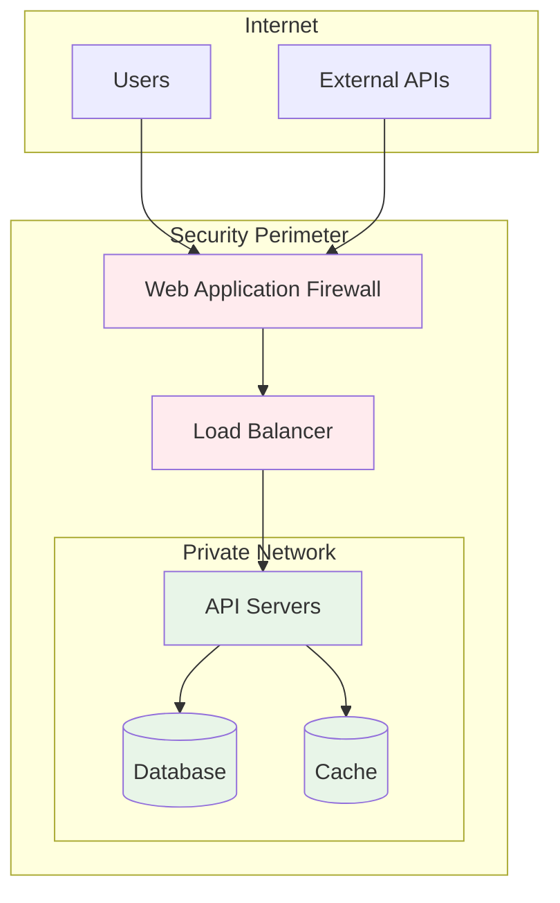

# Security Model

The Open PaaS Platform implements a comprehensive security framework designed to protect data, ensure secure communications, and maintain system integrity.

## Authentication Methods

Open PaaS Platform supports multiple authentication methods:

### API Key Authentication
```python
from openpaas_sdk import OpenPaaSClient

# Initialize with API key
client = OpenPaaSClient(api_key="sk_live_...")
```

### OAuth 2.0 Flow
```python
# OAuth configuration
oauth_config = {
    'client_id': 'your_client_id',
    'client_secret': 'your_client_secret',
    'redirect_uri': 'https://yourapp.com/callback'
}

client = OpenPaaSClient(oauth_config=oauth_config)
```

### JWT Token Authentication
```python
# JWT token authentication
client = OpenPaaSClient(jwt_token="eyJhbGciOiJIUzI1NiIs...")
```

## Authorization Framework

### Role-Based Access Control (RBAC)

The platform uses RBAC to manage permissions:

- **Admin**: Full platform access
- **Developer**: Connector and integration management
- **Viewer**: Read-only access to resources
- **Service**: Limited scope for service-to-service communication

### Permission Scopes

| Scope | Description | Example Operations |
|-------|-------------|-------------------|
| `connectors:read` | View connector configurations | List connectors, view settings |
| `connectors:write` | Create and modify connectors | Create, update, delete connectors |
| `data:read` | Access processed data | Query data, export results |
| `data:write` | Modify data and workflows | Create workflows, process data |
| `webhooks:manage` | Manage webhook endpoints | Create, update webhook URLs |

## Data Protection
 Follow these best practices to protect your data:

### Encryption Standards

**Data in Transit**
- TLS 1.3 for all API communications
- Certificate pinning for mobile applications
- Perfect Forward Secrecy (PFS)

**Data at Rest**
- AES-256 encryption for database storage
- Encrypted file storage with key rotation
- Hardware Security Modules (HSM) for key management

### Data Classification

- **Public**: Marketing materials, documentation
- **Internal**: System logs, metrics
- **Confidential**: Customer data, API keys
- **Restricted**: Payment information, personal data

## Network Security

Follow these best practices to secure your network:

### Infrastructure Protection



### Security Monitoring

- **Real-time threat detection**
- **Automated incident response**
- **Security audit logging**
- **Compliance reporting**

## Compliance Standards

The platform maintains compliance with:

- **SOC 2 Type II**: Security, availability, and confidentiality
- **PCI DSS**: Payment card industry standards
- **GDPR**: European data protection regulation
- **HIPAA**: Healthcare data protection (available on request)

## Security Best Practices

### For Developers

1. **API Key Management**
   - Store keys in environment variables
   - Rotate keys regularly
   - Use different keys for different environments

2. **Input Validation**
   - Validate all input data
   - Use parameterized queries
   - Implement rate limiting

3. **Error Handling**
   - Don't expose sensitive information in errors
   - Log security events appropriately
   - Implement proper exception handling

### For Administrators

1. **Access Control**
   - Follow principle of least privilege
   - Regular access reviews
   - Multi-factor authentication

2. **Monitoring**
   - Enable audit logging
   - Set up security alerts
   - Regular security assessments
