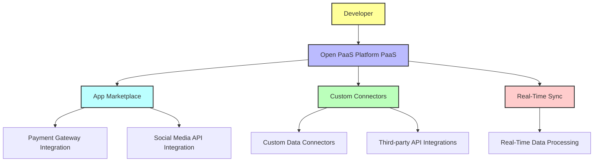

# Platform-as-a-Service (PaaS)

Platform-as-a-Service (PaaS) is a cloud computing model that provides a fully managed environment for developers to build, test, deploy, and manage applications without worrying about the underlying infrastructure. Unlike Infrastructure-as-a-Service (IaaS), which provides raw computing resources, PaaS offers a more abstracted, user-friendly platform that includes everything needed for software development.

**How Open PaaS Platform Implements PaaS**

The Open PaaS Platform is designed to empower developers by providing the necessary tools and capabilities to quickly integrate with external systems and create custom applications. Key features include:

* **App Marketplace:** Developers can create and deploy custom connectors and logic applications, which extend the platform’s capabilities.
* **API Integrations:** Seamlessly integrates with external APIs such as payment processing, social media, and analytics services, allowing users to extend their applications easily.
* **Real-Time Sync:** Supports real-time data synchronization and processing, enabling applications to receive live updates and maintain current states.
* **Custom Connectors:** Developers can create their own connectors to integrate with external services, databases, and third-party APIs, which is essential for meeting business needs and expanding platform functionalities.

**How Developers interact with Open PaaS Platform**

As shown in the diagram:

* Developers interact with the Open PaaS Platform PaaS.
* Through the App Marketplace, they can deploy and share applications.
* Custom Connectors and Real-Time Sync enable interaction with external APIs and services.
* Payment Gateway Integration and Social Media API Integration are examples of third-party services that developers can integrate into their applications on the platform.

 

-   :material-star-outline:{ .lg .middle } __Getting Started__
    
    ---

    A step-by-step guide to help you set up and start using the Open PaaS Platform, including basic configurations and setup.
    
    [:octicons-arrow-right-24: Explore Guide](./getting-started/quick-start.md)

-   :material-lightbulb-outline:{ .lg .middle } __Golden Use Cases__
    
    ---

    Learn how to leverage the most common and valuable use cases for the Open PaaS Platform to solve real-world problems.
    
    [:octicons-arrow-right-24: Explore Guide](./golden-usecases/overview.md)

